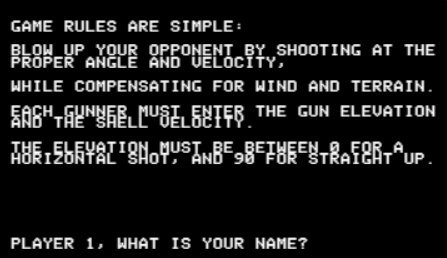
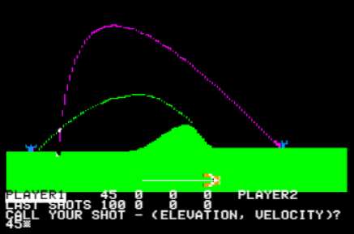

# SuperArtillery

A modern web-based remake of the classic 1980 Apple II artillery game, bringing retro gaming nostalgia to the browser with real-time multiplayer capabilities.




## 📖 Project Overview

**SuperArtillery** is a faithful recreation of the original Apple II BASIC game published in 1980 by Rainy City Software (Greg Stein). The game features turn-based artillery combat where two players attempt to destroy each other's castles by calculating the proper angle and velocity while compensating for wind and terrain.

### Original Game Features
- Two-player turn-based combat
- Randomly generated terrain profiles
- Wind effects on projectile trajectory
- Physics-based ballistics simulation
- Castle destruction mechanics
- Score tracking across multiple rounds

The original source code is preserved in [`docs/SuperArtillery.Apple][.Basic`](docs/SuperArtillery.Apple][.Basic) for reference and historical preservation.

## 🎯 Project Goals

1. **Preserve the Classic Gameplay**: Maintain the core mechanics and feel of the original game
2. **Modernize the Experience**: Leverage modern web technologies for smooth graphics and animations
3. **Enable Online Multiplayer**: Allow players to compete over the internet in real-time
4. **Responsive Design**: Support various screen sizes and devices

## 🏗️ Architecture

The project follows a client-server architecture with clear separation of concerns:

```
┌─────────────────────────────────────────────────────────────────┐
│                         SUPERARTILLERY                          │
└─────────────────────────────────────────────────────────────────┘

┌──────────────────────────┐                ┌──────────────────────┐
│     FRONT-END (FE)       │  WebSocket +   │   BACK-END (BE)      │
│   Browser Application    │   REST API     │  Node.js + TypeScript│
│      (TypeScript)        │◄──────────────►│                      │
├──────────────────────────┤                ├──────────────────────┤
│                          │                │                      │
│  ┌────────────────────┐  │                │  ┌────────────────┐  │
│  │  HTML5 Canvas      │  │   WebSocket    │  │ WebSocket      │  │
│  │  - Rendering       │  │◄───────────────│  │ Server (ws)    │  │
│  │  - Animations      │  │  Real-time     │  │ - Live updates │  │
│  │  - UI/Controls     │  │  game updates  │  │ - Game events  │  │
│  └────────────────────┘  │                │  └────────────────┘  │
│                          │                │                      │
│  ┌────────────────────┐  │                │  ┌────────────────┐  │
│  │  Game Engine       │  │   REST API     │  │ Express Server │  │
│  │  - Physics         │  │◄───────────────│  │ - Auth         │  │
│  │  - Collision       │  │  HTTP/HTTPS    │  │ - Matchmaking  │  │
│  │  - Input handling  │  │  Stateless ops │  │ - Stats        │  │
│  └────────────────────┘  │                │  │ - Leaderboard  │  │
│                          │                │  └────────────────┘  │
│  ┌────────────────────┐  │                │                      │
│  │  Terrain Generator │  │                │  ┌────────────────┐  │
│  │  - Random hills    │  │                │  │ Game Manager   │  │
│  │  - Castle placement│  │                │  │ - Matchmaking  │  │
│  └────────────────────┘  │                │  │ - Room mgmt    │  │
│                          │                │  │ - State sync   │  │
│  ┌────────────────────┐  │                │  └────────────────┘  │
│  │  Network Layer     │  │                │                      │
│  │  - WebSocket client│  │                │  ┌────────────────┐  │
│  │  - REST client     │  │                │  │ Game Logic     │  │
│  │  - Type-safe msgs  │  │                │  │ - Validation   │  │
│  └────────────────────┘  │                │  │ - Hit detect   │  │
│                          │                │  │ - Win logic    │  │
└──────────────────────────┘                │  └────────────────┘  │
         │                                  │                      │
         │  Technologies:                   │  ┌────────────────┐  │
         │  • TypeScript                    │  │ Shared Types   │  │
         │  • HTML5 Canvas API              │  │ - Player.ts    │  │
         │  • CSS3                          │  │ - GameState.ts │  │
         │  • Vite/Webpack                  │  │ - Messages.ts  │  │
         │                                  │  └────────────────┘  │
         │  Deployment:                     └──────────────────────┘
         │  • GitHub Pages / Netlify               │
         │  • Vercel                               │  Technologies:
         └─────────────────────────────────────────┤  • TypeScript
                                                   │  • Node.js + Express
                                                   │  • ws (WebSocket)
                                                   │  • Shared type defs
                                                   │
                                                   │  Deployment:
                                                   │  • Render / Railway
                                                   │  • Heroku / AWS
                                                   └──────────────────
         │                                             │
         │  Deployment:                                │  Deployment:
         │  • GitHub Pages / Netlify                   │  • Render / Railway
         │  • Vercel                                   │  • Heroku / AWS
         └─────────────────────────────────────────────┘
```

### Communication Protocol

#### REST API Endpoints (HTTP/HTTPS)

```typescript
// Matchmaking & Lobby
POST   /api/lobby/join          // Join matchmaking queue
GET    /api/lobby/status/:id    // Check queue status
POST   /api/game/create         // Create private game

// Player & Stats
POST   /api/auth/login          // Player authentication
GET    /api/players/:id/stats   // Get player statistics
GET    /api/leaderboard         // Global rankings

// Game Info
GET    /api/game/:id            // Get game metadata
GET    /api/game/:id/replay     // Get game replay data

// Health
GET    /api/health              // Server health check
```

#### WebSocket Messages (Real-time Game Events)

```typescript
// Client → Server (via WebSocket)
interface FireAction {
  type: "fire";
  payload: { 
    angle: number;      // 0-90 degrees
    velocity: number;   // Shell velocity
  };
}

interface ReadyMessage {
  type: "ready";
  payload: { playerId: string };
}

// Server → Client (via WebSocket)
interface GameStarted {
  type: "game_started";
  payload: { 
    gameId: string;
    terrain: number[];        // Height map
    wind: number;             // -50 to 50
    players: Array<{
      id: string;
      name: string;
      castleX: number;
    }>;
  };
}

interface ProjectileUpdate {
  type: "projectile_update";
  payload: {
    x: number;
    y: number;
    vx: number;              // Velocity X
    vy: number;              // Velocity Y
  };
}

interface HitEvent {
  type: "hit";
  payload: {
    target: "castle" | "terrain";
    damage: number;
    position: { x: number; y: number };
  };
}

interface GameOver {
  type: "game_over";
  payload: {
    winner: string;
    scores: { [playerId: string]: number };
  };
}
```

## 🗂️ Project Structure

```
SuperArtillery/
├── docs/
│   ├── SuperArtillery.Apple][.Basic   # Original 1980 source code
│   └── Project-Breakdown.md           # Initial implementation plan
├── img/
│   ├── Screenshot-rules.png           # Game rules screenshot
│   └── Screenshot-game-play.png       # Gameplay screenshot
├── src/                               # (To be created)
│   ├── index.html
│   ├── css/
│   │   └── style.css
│   ├── ts/                            # TypeScript source
│   │   ├── main.ts
│   │   ├── game.ts
│   │   ├── physics.ts
│   │   ├── terrain.ts
│   │   ├── renderer.ts
│   │   ├── network/
│   │   │   ├── websocket.ts
│   │   │   └── api.ts                # REST API client
│   │   └── types/
│   │       ├── game.ts               # Shared with backend
│   │       ├── player.ts
│   │       └── messages.ts
│   ├── assets/
│   │   └── sounds/                    # Optional sound effects
│   ├── tsconfig.json
│   └── vite.config.ts                 # Build configuration
├── package.json
└── README.md
```

### Back-End Project Structure (Separate Repository)

```
SuperArtillery-Server/
├── src/
│   ├── server.ts                      # Main entry point
│   ├── httpServer.ts                  # Express REST API
│   ├── websocketServer.ts             # WebSocket server
│   ├── routes/
│   │   ├── auth.ts                    # POST /api/auth/*
│   │   ├── lobby.ts                   # POST /api/lobby/*
│   │   ├── stats.ts                   # GET /api/stats/*
│   │   └── health.ts                  # GET /api/health
│   ├── handlers/
│   │   ├── gameHandler.ts             # WebSocket game events
│   │   └── connectionHandler.ts       # WS connect/disconnect
│   ├── services/
│   │   ├── matchmaking.ts             # Queue management
│   │   ├── gameManager.ts             # Active games
│   │   └── authService.ts             # JWT validation
│   ├── models/
│   │   ├── Player.ts
│   │   ├── Room.ts
│   │   └── GameState.ts
│   ├── types/                         # Shared with frontend
│   │   ├── game.ts
│   │   ├── player.ts
│   │   └── messages.ts
│   └── utils/
│       ├── physics.ts                 # Server-side validation
│       └── logger.ts
├── tsconfig.json
├── package.json
├── .env.example
└── README.md
```

## 🎮 Game Mechanics (From Original)

### Core Rules
1. Two players take turns firing at each other's castles
2. Each shot requires:
   - **Elevation angle**: 0° (horizontal) to 90° (straight up)
   - **Velocity**: Shell speed (max ~350 before cannon explodes)
3. Wind affects projectile trajectory
4. Terrain provides obstacles and strategic elements
5. First to win the agreed number of rounds wins the match

### Physics Simulation
- Gravity: Constant downward acceleration
- Wind resistance: Affects horizontal velocity over time
- Projectile trajectory: Parabolic path modified by wind
- Collision: Hit detection with terrain and castles

## 🛠️ Technology Stack

### Front-End
- **Language**: TypeScript
- **Rendering**: HTML5 Canvas API
- **Styling**: CSS3
- **Networking**: 
  - WebSocket API (real-time game events)
  - Fetch API (REST endpoints)
- **Build Tools**: Vite (fast bundler with TypeScript support)
- **Type Safety**: Shared type definitions with backend

### Back-End
- **Language**: TypeScript
- **Runtime**: Node.js
- **Framework**: Express (REST API endpoints)
- **WebSocket**: ws library (real-time communication)
- **Type Safety**: Shared type definitions with frontend
- **Utilities**: 
  - dotenv (environment variables)
  - winston/pino (logging)
  - jsonwebtoken (JWT authentication)

### DevOps
- **Version Control**: Git/GitHub
- **Front-End Hosting**: GitHub Pages, Netlify, or Vercel
- **Back-End Hosting**: Render, Railway, Heroku, or AWS
- **CI/CD**: GitHub Actions (optional)

## 🎨 Design Decisions

### 1. **Client-Server Architecture**
- **Decision**: Use authoritative server model
- **Rationale**: Prevents cheating, ensures fair gameplay, enables proper matchmaking
- **Trade-off**: Adds complexity vs. peer-to-peer, but necessary for online play

### 2. **HTML5 Canvas vs. WebGL**
- **Decision**: Use Canvas 2D API
- **Rationale**: Simpler implementation, sufficient for 2D graphics, easier debugging
- **Trade-off**: Less performance headroom, but adequate for this game's needs

### 3. **Hybrid Architecture: REST + WebSockets**
- **Decision**: Use REST API for stateless operations, WebSockets for real-time game events
- **Rationale**: 
  - REST: Perfect for matchmaking, stats, authentication (cacheable, stateless)
  - WebSockets: Essential for smooth projectile animation (low latency, real-time)
- **Trade-off**: Two communication protocols, but each optimized for its use case

### 4. **TypeScript for Full Stack**
- **Decision**: Use TypeScript for both frontend and backend
- **Rationale**: 
  - Type safety prevents bugs
  - Shared type definitions between FE/BE
  - Better IDE support and refactoring
  - Self-documenting code
- **Trade-off**: Slightly more setup time, but massive development benefits

### 5. **Server-Side Validation**
- **Decision**: Optional validation of physics calculations
- **Rationale**: Anti-cheat protection, maintain game integrity
- **Trade-off**: More server computation, but can be made optional

### 6. **Terrain Generation**
- **Decision**: Server generates terrain, sends to clients
- **Rationale**: Ensures both players see identical terrain
- **Alternative**: Seed-based generation (both clients generate from same seed)

## 📝 Getting Started

### Front-End Development
```bash
# Clone the repository
git clone https://github.com/yourusername/SuperArtillery.git
cd SuperArtillery

# Install dependencies
npm install

# Run development server (with hot reload)
npm run dev
# Visit http://localhost:5173

# Build for production
npm run build

# Type check
npm run type-check
```

### Back-End Development
```bash
# Clone the back-end repository
git clone https://github.com/yourusername/SuperArtillery-Server.git
cd SuperArtillery-Server

# Install dependencies
npm install

# Set up environment variables
cp .env.example .env
# Edit .env with your configuration:
# PORT=3000
# JWT_SECRET=your-secret-key
# NODE_ENV=development

# Run development server (with hot reload)
npm run dev

# Build TypeScript
npm run build

# Run production server
npm start

# Type check
npm run type-check
```

## 🤝 Contributing

Contributions are welcome! Please feel free to submit a Pull Request.

## 📜 License

This project is a remake of the original SuperArtillery game published in 1980 by Rainy City Software (Copyright © 1980, Greg Stein). This remake is created for educational and nostalgic purposes.

## 🔗 Links

- **Back-End Repository**: [Coming Soon]
- **Live Demo**: [Coming Soon]
- **Original Source Code**: [`docs/SuperArtillery.Apple][.Basic`](docs/SuperArtillery.Apple][.Basic)

---