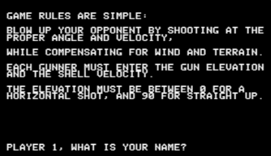

# SuperArtillery

TypeScript multiplayer artillery game with a browser client and Node.js server.




## Quick Start

Prerequisites:

- Node.js 26+
- npm 10+

Install dependencies:

```bash
npm install
cd server && npm install
cd ../client && npm install
```

Run locally in two terminals:

```bash
cd server
npm run dev
```

```bash
cd client
npm run dev
```

Server: http://localhost:3000
Client: http://localhost:5173
Swagger UI: http://localhost:3000/api/swagger

Cloud deployment:

- Client: [Open the deployed client](https://pro-duck400.github.io/SuperArtillery/)
- Server: [Open the deployed server](https://superartillery.onrender.com/api/v1/health)
- The deployed client uses the deployed server automatically. Local client development uses `http://localhost:3000` by default.

## Where To Find Docs

Primary docs are in subfolders:

- [server/README.md](server/README.md): server setup, endpoints, runtime notes
- [client/README.md](client/README.md): client setup and runtime expectations
- [contracts/README.md](contracts/README.md): contract-first workflow and generation

Contract source of truth:

- [contracts/openapi/superartillery.yaml](contracts/openapi/superartillery.yaml)

Supporting docs:

- [docs/API.md](docs/API.md)
- [docs/SuperArtillery.Apple][.Basic](docs/SuperArtillery.Apple][.Basic)

## Common Commands

```bash
npm run contracts:generate
npm run contracts:check
```

## Deploy Client To GitHub Pages

This repository now includes a GitHub Actions workflow that builds and deploys the Vite client from `client/` to GitHub Pages.

1. Push to `main` (or run the `Deploy Client To GitHub Pages` workflow manually from Actions).
2. In GitHub repository settings, ensure Pages source is set to GitHub Actions.
3. After deployment, the site URL will look like:
	- `https://<your-username>.github.io/SuperArtillery/`

Important runtime note:

- The hosted client is static only. It still needs a reachable backend server for API and WebSocket.
- The deployed client is configured to use the deployed backend automatically.