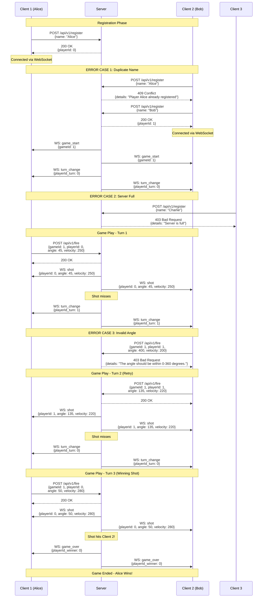

# API Documentation

## Communication Protocol

This document describes the REST API and WebSocket communication used by the MVP version of the game.

Clients and server communicates via HTTP(S) endpoints & WebSocket messages. 

Clients call HTTP(S) endpoints exposed by the server to start an action.

Upon action the server sends WebSocket messages to connected clients to keep them up-to date with the changes of the game state.

---

## REST API Endpoints (HTTP/HTTPS)

### Registration

Register the player on the server. Server responds with `playerId` if registration is successful.

**POST** `/api/v1/register`

**Payload:**
```json
name: string
```
**Response:**

- 200 Success 
```json
playerId: 0 | 1
```
- 409 Conflict
```json
details: "Player {name} already registered"
```
- 403 Bad request
```json
details: "Server is full"
```
Other possible error:
- Bad request: name is required

(When two players are already connected, refusing the 3rd player to connect)

---

### Fire Action

Sends the firing action for the current player's turn. If server responds with 200 Success, each player receives WebSocket message `shot` with the given details of the shot. Followed by either `turn_change` if no one is hit or `game_over` if any player is hit.

**POST** `/api/v1/fire`

**Payload**
```json
gameId: number;
playerId: number;
angle: number;
velocity: number;
```

**Response:**

- 200 Success 

- 403 Bad Request
```json
details: string = "The error message goes here".
```
Possible errors:

- GameId {gameId} is unknown.
- PlayerId {playerId} is unknown.
- Player should wait for its turn to fire.
- The angle should be within 0-360 degrees.
- The velocity should be positive.

---
## WebSocket Messages (Real-time Game Events)

WebSockets messages are send from server to synchronise the current game state changes between the server and connected clients.

---

### Server → Client

#### Game Start

Sent when the second player connects and the game begins.

```json
{
  "type": "game_start",
  "gameId": number,
}
```

#### Shots Fired

Broadcast to both players after a successful fire action.

```json
{
  "type": "shot",
  "playerId": 0 | 1,
  "angle": number, /*between 0-360*/
  "velocity": nubmer /* > 0; Velocity over 350 blows up the shooting player */
}
```

#### Turn Change

Sent when a shot misses and the turn switches to the other player.

```json
{
  type: "turn_change",
  playerId_turn: 0 | 1
}
```

#### Game Ends

Sent when a player wins the game.

```json
{
  type: "game_over",
  playerId_winner: 0 | 1
}
```

---

## Sample Game Flow Diagram

The following diagram illustrates a complete game session including successful registration, gameplay, and common error scenarios.

**[📊 View Interactive Diagram](API-diagram.png)**



### Key Points Illustrated:
- **Successful Registration**: Both players register and receive unique player IDs (0 and 1)
- **Game Start**: WebSocket message broadcast to both clients once 2 players are registered
- **Turn-based Gameplay**: Players alternate firing shots
- **Error Handling**: 
  - Duplicate name registration returns 409 Conflict
  - Invalid angle (400°) returns 403 Bad Request
- **Game Conclusion**: Winning shot triggers `game_over` message to both clients

